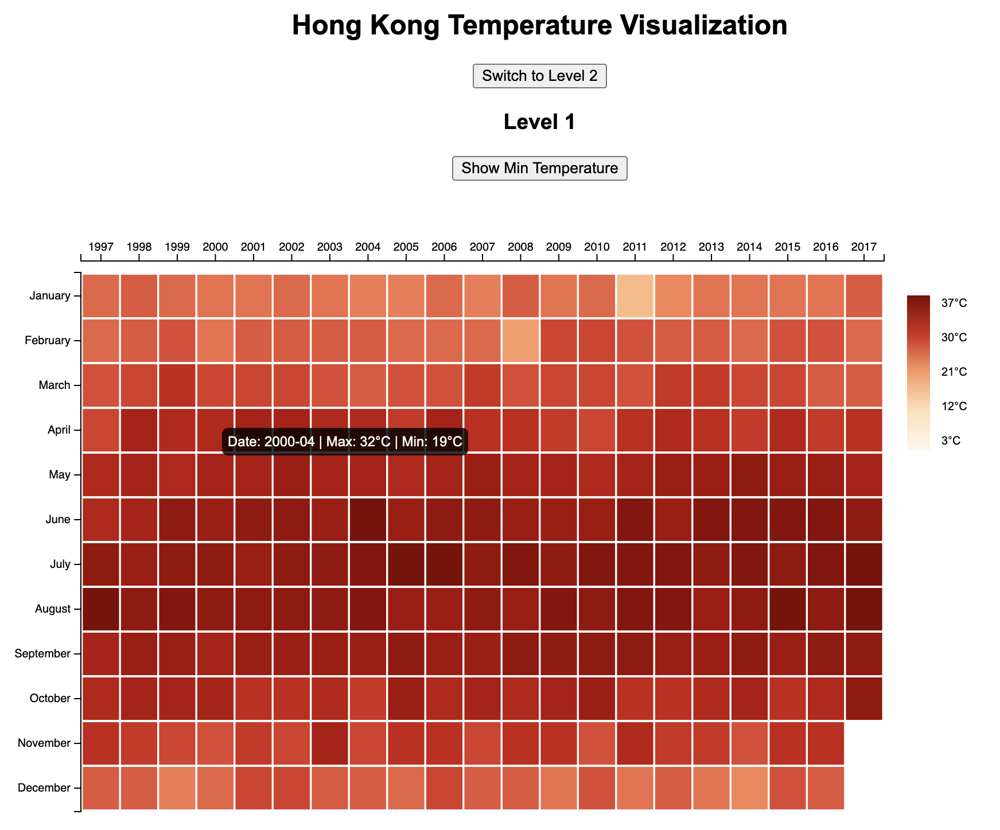
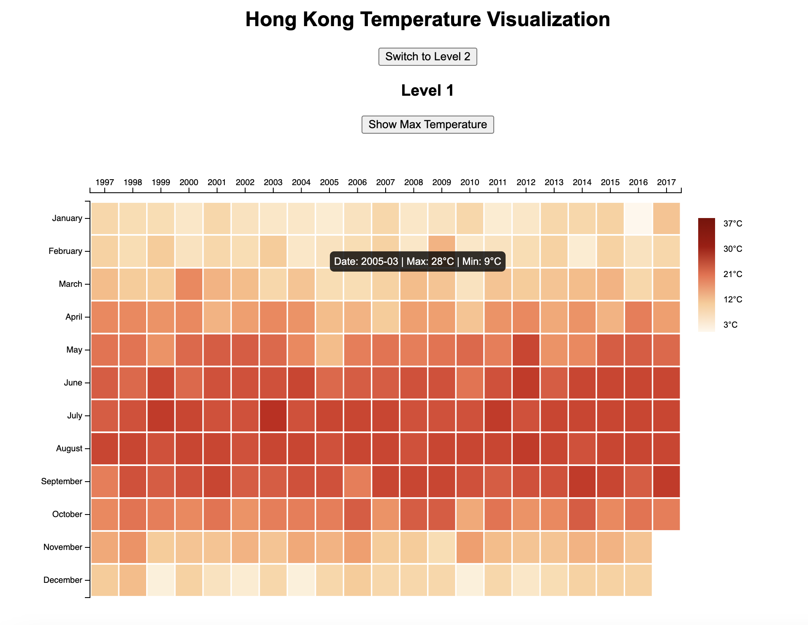
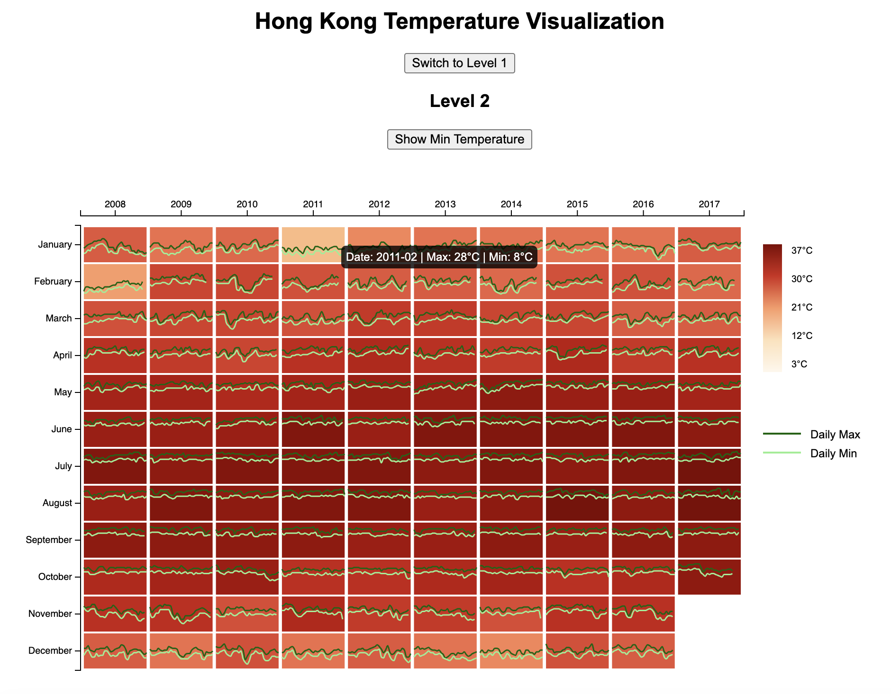

# Data-Visualization-Assignment-2

# Hong Kong Temperature Visualization

This work visualizes Hong Kong's **monthly and daily temperature variations** using **D3.js**. The visualization consists of two levels:

- **Level 1 (Matrix View):** Displays **monthly temperatures across years**.
- **Level 2 (Trend Lines):** Includes **daily temperature variations within each month**.

This visualization allows users to interactively **toggle between levels** and **switch between maximum and minimum temperatures**.

## Legend
- A **color gradient legend** maps temperature values to colors.
- In **Level 2**, additional legend indicates **daily maximum and minimum trends**.

## Screenshots
### **1.  Level 1 - Max Temperature View**

### **2. Level 1 - Min Temperature View**

### **3. Level 2 - Max Temperature View**

### **4. Level 2 - Min Temperature View**

## How does it work?
1. **Level 1 (Matrix View)** is displayed by default.
2. Click **"Switch to Level 2"** to view **daily temperature trends**.
3. Click **"Show Min Temperature"** / **"Show Max Temperature"** to toggle views.
4. **Tooltip on hover** shows exact min and max temperature details.

## Author
**Harshita Mandalika**
